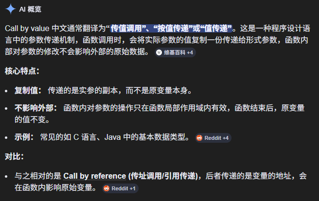
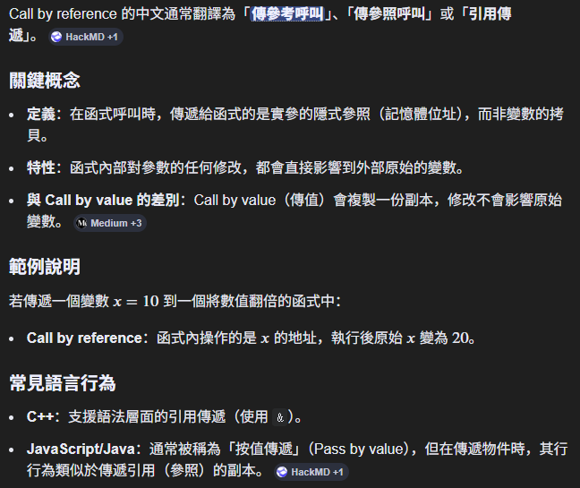
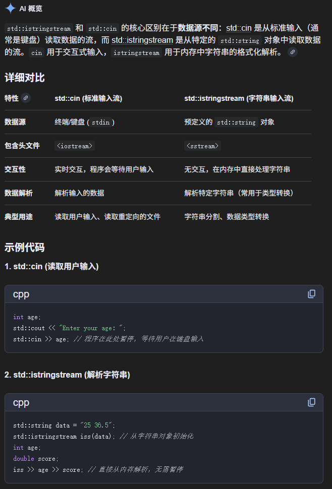
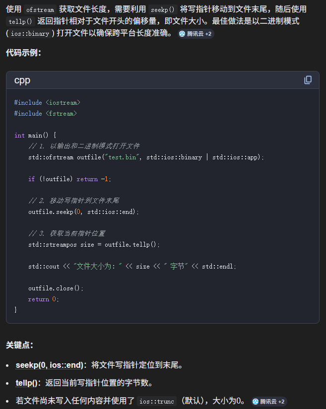
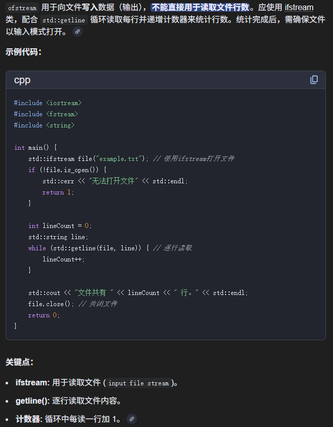
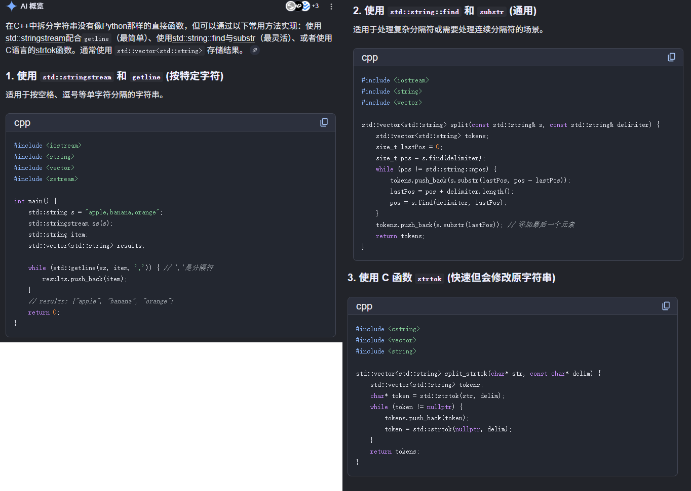
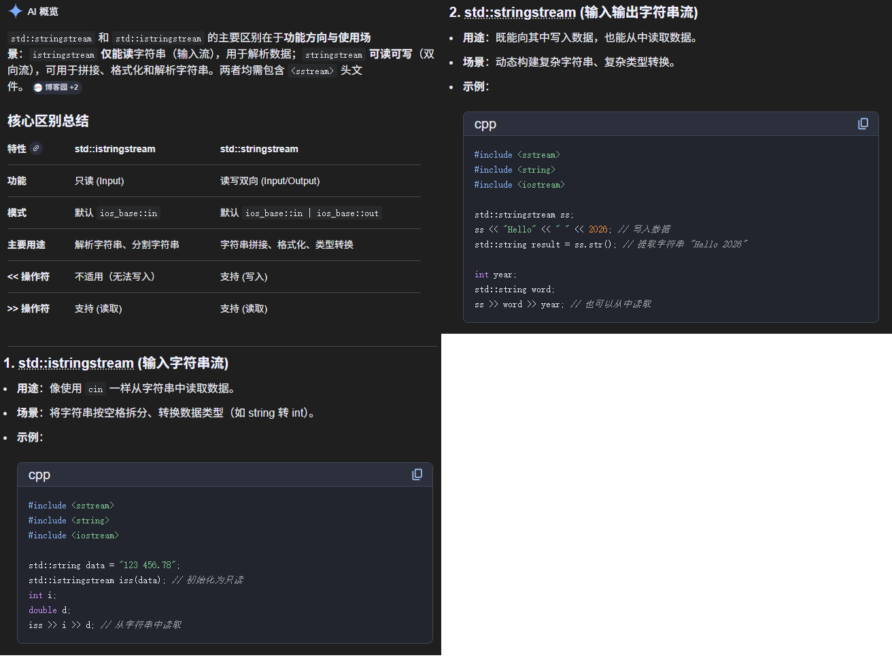
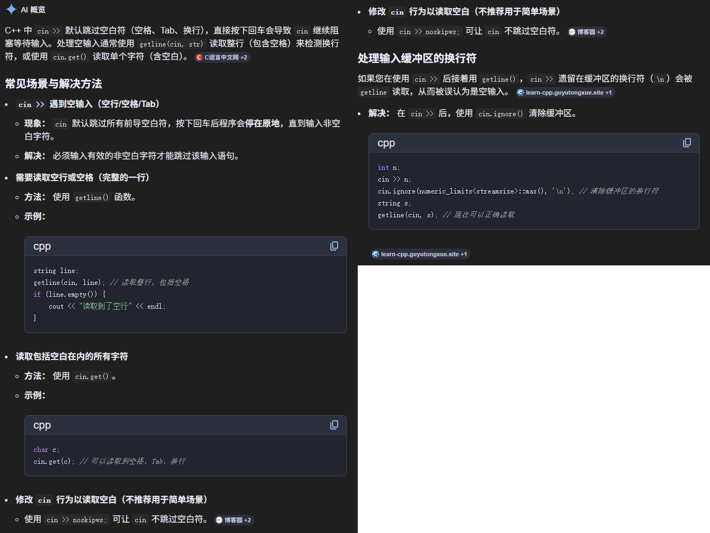
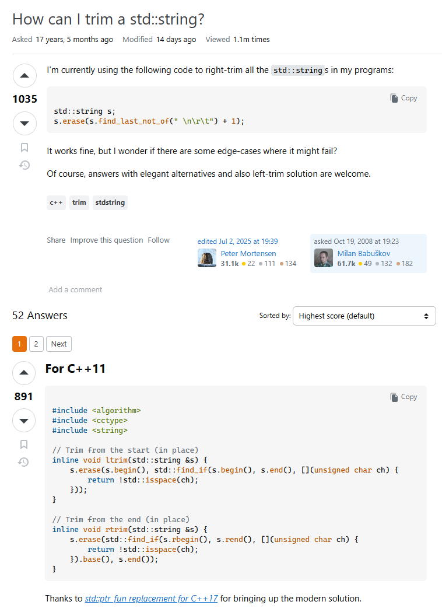

# 📘 C++ 基础知识图解汇总

本目录收录了一组 C++ 学习过程中常见的**核心知识点图解**，通过图片辅助理解关键概念，适合初学者快速建立整体认知。

---

## 🧩 内容总览

本章节主要涵盖以下知识点：

* 基本类型与 int 相关问题
* 传值调用 (call by value)
* 引用调用 (call by reference)
* 输入输出流 (cin / stringstream / ifstream / ofstream)
* 文件读写机制
* 字符串处理
* 输入校验
* 常见易错点总结

---

## 📚 图解目录

### 1️⃣ int 整型问题


📌 说明：

* 不同整型范围
* 溢出问题
* 类型转换风险

### 2️⃣.1 传值调用 (Call by Value)



📌 说明：

* 参数传递的本质
* 与引用传递的区别
* 修改原变量的机制
* 类型转换风险

### 2️⃣.2 引用传递 (Call by Reference)



📌 说明：

* 引用的本质 (变量别名)
* 与传值调用的区别
* 修改原变量的机制

### 3️⃣ istringstream 和 cin 的区别



📌 说明：

* cin：标准输入流
* istringstream：字符串流解析
* 适用场景对比 (文件解析 vs 用户输入)

### 4️⃣ ofstream 获取长度问题



📌 说明：

* 文件写入流的行为
* 文件指针位置
* 为什么不能直接用 ofstream 获取长度

### 5️⃣ ios::app 是什么意思


📌 说明：

* 追加写入模式 (append)
* 与覆盖模式的区别
* 文件写入常见坑

### 6️⃣ ifstream 读取行数



📌 说明：

* 如何逐行读取文件
* 行数统计方法
* EOF (文件结束)处理

### 7️⃣ 分割字符串 (字符串解析)



📌 说明：

* 使用 stringstream / getline 分割
* 按空格或分隔符解析
* 常见解析错误

### 8️⃣ stringstream vs istringstream



📌 说明：

* stringstream：通用流
* istringstream：输入流
* 使用场景差异

### 9️⃣ 判断输入是否为空



📌 说明：

* getline 获取空字符串问题
* 输入校验的重要性
* 防止非法输入

### 🔟 去除左右两侧空格 (trim)



📌 说明：

* ltrim / rtrim 实现思路
* isspace 的使用
* 字符串清洗技巧

---

## 🧠 学习建议

建议按以下顺序学习：

```text
基础类型 → 引用 → 输入流 → 字符串处理 → 文件读写 → 异常与边界处理
```

---

## ⚠️ 常见坑总结

* ❌ `size_t` 与负数混用导致越界
* ❌ `cin` 与 `getline` 混用导致读空
* ❌ `stoi / stof` 未处理异常
* ❌ 文件未判断 `is_open()`
* ❌ 字符串未 trim 导致判断错误

---

## 🎯 本章节目标

通过这些图解，你应该能够：

* ✅ 理解 C++ 输入输出流机制
* ✅ 掌握字符串处理基础
* ✅ 学会文件读写基本操作
* ✅ 避免常见初学者错误

---

✨ 建议：结合代码一起阅读这些图解，效果最佳！

---
